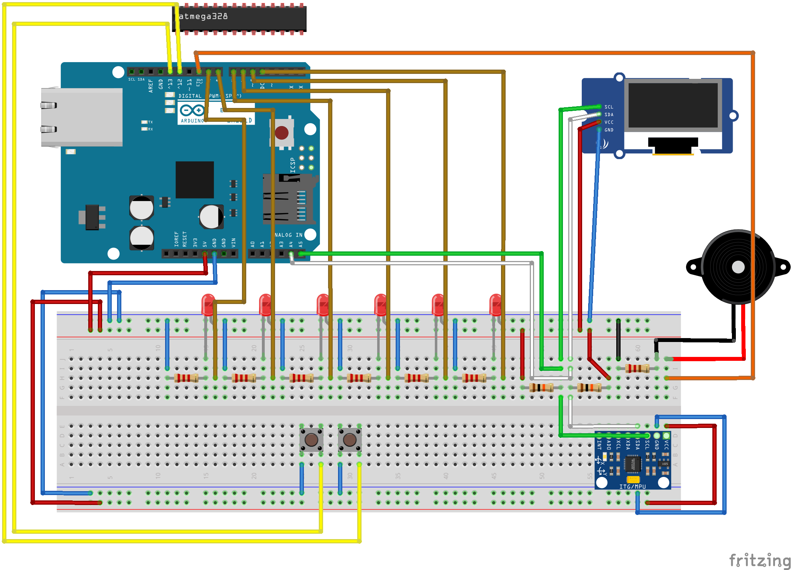

# LieDownTimer
Create timer device.

# 機能(予定)
- 6角形のデバイスを倒すとタイマーがカウントダウンを開始する。
  - 3、5、10、15、25、30の6パターンがプリセット
- タイムアップ時に10秒間、音が鳴り、LEDが光る。
  - 音はミュートボタンでミュートできる。
- 水平設定ボタンで多少斜めでも機能する。
- 分設定ボタンと秒設定ボタンでカスタムした時間でカウントダウンできる。
- バッテリー駆動(かなり理想かも)

# 回路図
# ブレッドボード

# 必要素材
- ジャイロセンサー(MPU-6050) *1
- oledディスプレイ(128*64) *1
- beep用ブザー *1
- 発光ダイオード *6?

***ブザーと発光ダイオードは試していないから分からん。***
